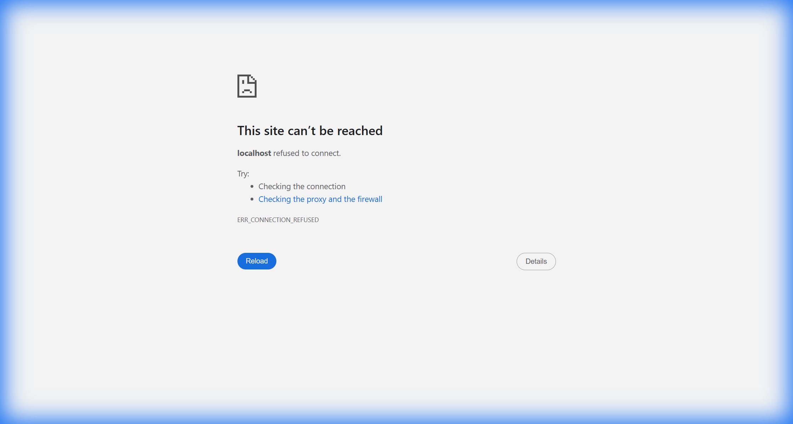
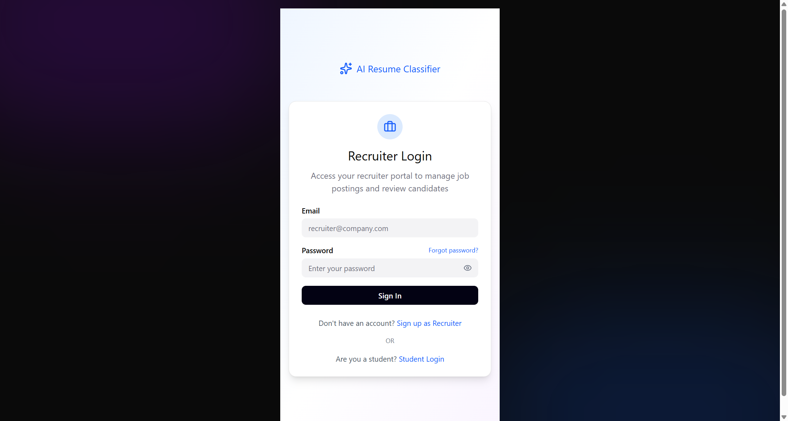
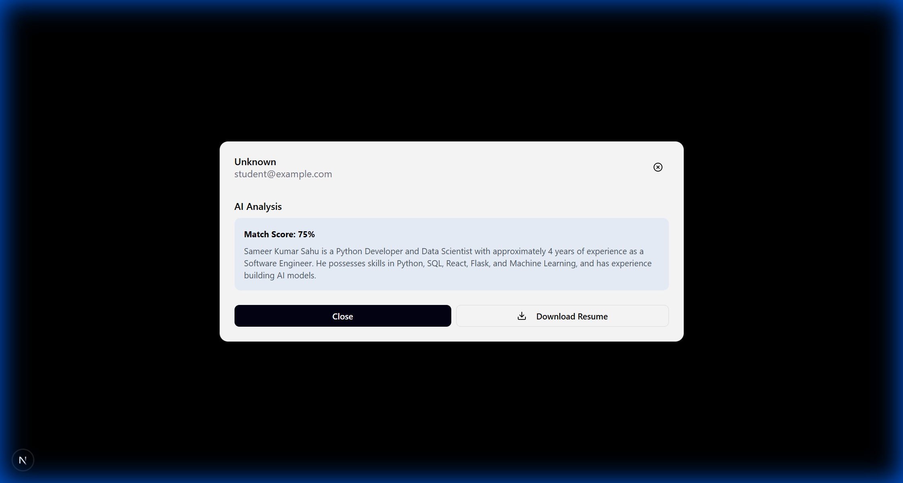

# AIRC - AI Resume Classifier & Analyzer

A powerful AI-powered platform that helps recruiters automate resume screening and analysis, while empowering students with AI-driven insights to improve their job applications.

## 🚀 Features



### For Recruiters

- **Smart Job Posting:** Create and manage job listings with detailed requirements.
- **AI Resume Screening:** Automatically analyze incoming applications against job descriptions.
- **Candidate Ranking:** Get match scores and detailed analysis for every applicant.
- **Efficiency:** Drastically reduce time-to-hire by focusing on the best candidates.




### For Students
- **Smart Job Search:** Browse and search for relevant opportunities.
- **One-Click Apply:** Easy application process with resume upload.
- **AI Insights:** Understand how well your profile matches the job requirements.
- **Application Tracking:** Real-time status updates on all applications.

## 🛠️ Technology Stack

- **Frontend:** Next.js, React, Tailwind CSS, Framer Motion
- **Backend:** Flask, Python, SQLAlchemy
- **AI Engine:** Google Gemini Pro / OpenAI GPT-4 (configurable)
- **Database:** SQLite (Development) / PostgreSQL (Production ready)

## 🏁 Getting Started

### Prerequisites
- Node.js (v18+)
- Python (v3.9+)
- Git

### Installation

1. **Clone the repository**
   ```bash
   git clone https://github.com/KrishnaPradhan1/AIRC-Resume_classifier_-_analyzer_job_portal.git
   cd AIRC-Resume_classifier_-_analyzer_job_portal
   ```

2. **Backend Setup**
   ```bash
   cd backend
   python -m venv venv
   # Windows
   venv\Scripts\activate
   # Mac/Linux
   # source venv/bin/activate
   
   pip install -r requirements.txt
   
   # Setup environment variables
   # Create a .env file in backend/ with:
   # GEMINI_API_KEY=your_key_here
   # SECRET_KEY=your_secret_key
   ```

3. **Frontend Setup**
   ```bash
   cd ../frontend
   npm install
   ```

### Running the Application

1. **Start Backend Server**
   ```bash
   cd backend
   # Ensure venv is active
   python run.py
   ```
   Server will start at `http://localhost:5000`

2. **Start Frontend Server**
   ```bash
   cd frontend
   npm run dev
   ```
   Application will be available at `http://localhost:3000`

## 🧪 Testing

The project includes verification scripts in the `backend/` directory:
- `verify_full_flow.py`: Tests the entire Recruiter -> Job -> Student -> Application -> AI Analysis flow.

## 📄 License
MIT License
